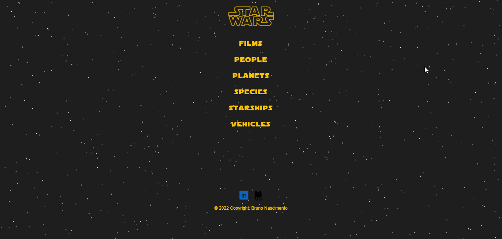

# Star Wars API



## Projeto pessoal consumindo a API Swapi

- O projeto em foi desenvolvido em React com Typescript, basicamente, é um um tela responsiva consumindo a api swapi.

## Tecnologias 🛠

- React
- Typescript
- Sass
- Css
- Git
- GitHub

## Como rodar o projeto na sua máquina ?

- Clonar o repositório com git clone

```bash

git clone https://github.com/brunonascimentoo/starWarsAPI.git

```

- Abrir a pasta do projeto no seu editor de código
- Executar o comando 'npm install' ou 'npm i', isso irá baixar as dependências do projeto.
- Após baixar as dependências só executar o comando npm run dev

### Observação, você precisa ter o node instalado!!!

# Contato

- bnascimento1996@gmail.com ❤

# LinkedIn

- https://www.linkedin.com/in/brunonascimento1996/ 🔗
